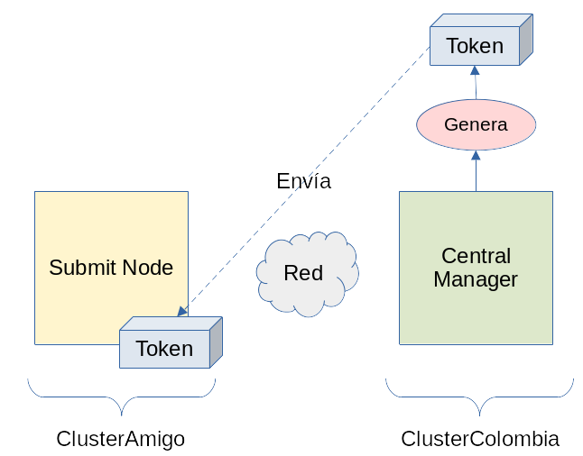

# Gestión de ID Tokens

## Introducción

En los pasos anteriores se han configurado los nodos del clúster para que realicen la autenticación y autorización de lo usuarios mediante *ID Tokens*.  Cada usuario deberá tener su propio *token* para poder interactúar con los servicios del clúster HTCondor y se distribuirán de la siguiente manera.

| Ubicación | Descripción |
| --- | --- |
| En el clúster que **RECIBE** el trabajo | El clúster que recibe el trabajo, para ejecutarlo correctamente no necesita tener instalados los *tokens* de los usuarios, sin embargo si ese usuario desea realizar labores administrativas en los nodos del clúster -como `condor_status`, `condor_q`, etc- dichos nodos SI necesitarán tener el *token* del usuario.<br><br>El usuario al cual se le otorga un *token* debe existir como usuario del sistema operativo en el `Central Manager` (`CM`) de este clúster. |
| En el nodo que **ENVÍA** el trabajo | El nodo que envía el trabajo (`SN`) debe tener instalado un *token* válido generado por el clúster que recibirá el trabajo. |

## Caso de ejemplo

Supóngase que el usuario `jorge` del `ClústerAmigo` está interesado en enviar trabajos al `ClústerColombia`.



1. En el `CM` de `ClusterColombia` se debe crear un `token` para `jorge`.
1. El `token` recién creado para `jorge` debe ser transmitido a la máquina de `ClusterAmigo` desde la cual se enviarán los trabajos (`SN`) al `ClusterColombia`.
1. En el `SN`, `jorge` deberá instalar su `token` bajo `~/.condor/tokens.d`.
1. Ya `jorge` estará habilitado para enviar trabajos desde `ClusterAmigo` hacia `ClusterColombia`.

## Procedimiento

### En ClusterColombia

En el `CM` del clúster que recibirá los trabajos, generar el `token` para el usuario solicitado.

```
$ sudo condor_token_create -identity jorge@clustercolombia.com > jorge@clustercolombia.com.token
```

El usuario, `jorge` en este caso, deberá tener una cuenta de usuario del sistema operativo en el `CM` del clúster.  En caso de no tenerse, se deberá crear una.

```
$ sudo useradd --comment 'Jorge I. Meza' \
               --create-home \
               jorge

$ sudo passwd jorge
```

Enviar el `token` recién creado para `jorge` al nodo (`SN`) del `ClusterAmigo` desde el cual se enviarán los trabajos al `ClusterColombia`.

```
$ scp jorge@clustercolombia.com.token 10.70.70.1:/tmp
```

### En ClusterAmigo

En el `SN`, ubicar apropiadamente el `token` de `jorge`.  Para hacer esto es necesario crear el directorio `~/.condor/tokens.d` si aún no se cuenta con este para el usuario designado.

```
$ sudo mkdir -p ~/.condor/tokens.d

$ sudo chown -R jorge:jorge ~/.condor/tokens.d
```

Mover el `token` recién transmitido desde el `ClusterColombia` al directorio apropiado.

```
$ mv /tmp/jorge@clustercolombia.com.token ~/.condor/tokens.d
```

Garantizar que el `token` recién instalado tenga el propietario y los permisos requeridos.

```
$ sudo chown jorge:jorge ~/.condor/tokens.d/jorge@clustercolombia.com.token

$ sudo chmod 0700 ~/.condor/tokens.d/jorge@clustercolombia.com.token
```

¡Listo!